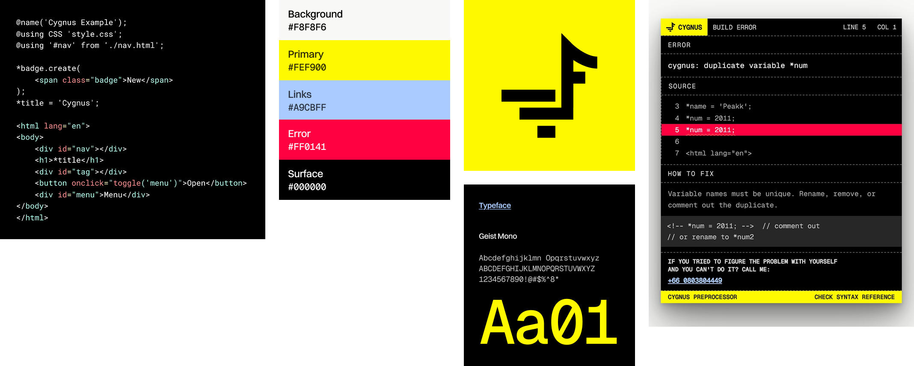

<p align="center">
    
</p>

<h3 align='center'>A lightweight HTML preprocessor<br>For native '.html' component files.</h3> 
<br>

<br>

## What is Cygnus?

Cygnus is an **HTML preprocessor** (not a framework & not a PHP) that adds component reuse, CSS injection, and variable templating to native `.html` files. It runs as a Vite plugin via `@peakk/cygnus`.

**Cygnus is a library.** You import its helpers in your own `vite.config.js` there's no scaffolding CLI.

## Installation

```bash
npm install @peakk/cygnus
npm install -D vite
```

> **Note:** Vite is a peer dependency. Cygnus will print a warning at startup if Vite is not installed.

## Get Started

**1. Create your project's `vite.config.js`** (see `templates/vite.config.js`):

```js
import { defineConfig } from 'vite';
import { cygnusPlugin } from '@peakk/cygnus';

export default defineConfig({
    root: 'src',
    build: {
        outDir: '../dist',
        emptyOutDir: true
    },
    server: {
        fs: { strict: false }
    },
    plugins: [cygnusPlugin()]
});
```

**2. Add scripts to your `package.json`:**

```json
{
  "scripts": {
    "dev": "vite",
    "build": "vite build",
    "preview": "vite preview"
  }
}
```

**3. Create `src/index.html`:**

```html
@name('My App')

<html lang="en">
<body>
    <h1>Hello Cygnus</h1>
</body>
</html>
```

**4. Run:**

```bash
npm run dev
```

That's it. A complete starter (vite.config.js, src/index.html, README) lives in the `templates/` folder of the package copy it into your project and edit.

## Syntax Reference

### `@name()` : auto-generate `<head>`
```html
@name('My App', './favicon.ico')
```

### `@using` : inject component
```html
@using "#nav" from "./components/nav.html"
```

### `@using CSS` : inject stylesheet
```html
@using CSS "dialog.css"
```

### `*name.create()` : reusable variable
```html
*badge.create(<span class="badge">New</span>)

@using "#item1" from *badge
@using "#item2" from *badge
```

### Cross-file variable
```html
<!-- card.html -->
*card.create(<div class="card"><h3>Hello</h3></div>)
```
```html
<!-- index.html -->
@using "#x" from *card in "card.html"
```

### `toggle()` : runtime class toggle
```html
<button onclick="toggle('dialog')">Open</button>
```

## API

The package exports two layers of helpers from `@peakk/cygnus`:

**Vite plugin (high-level):**
- `cygnusPlugin(opts)` Vite plugin factory; the main thing you import
- `processCygnusHtml(html, opts)` run a single HTML string through the pipeline
- `copyDirWithHtml(src, dest, isBuild)` recursively copy a folder, processing `.html` files
- `safeResolve(base, request, root)` path-traversal-safe resolver
- `HAS_DECL_RE` regex detecting any Cygnus directive in HTML

**Core pipeline (low-level):**
- `extractCalls`, `extractCssLinks`, `extractName`, `strip` (from `parse.js`)
- `extractVars`, `stripVars`, `interpolatePrimitives` (from `vars.js`)
- `rebuild` (from `inject.js`)
- `buildErrorOverlay` (from `error-overlay.js`)

If you want to embed Cygnus in a non-Vite pipeline, use the low-level helpers directly.

## License
MIT [LICENSE.md](./LICENSE.md)