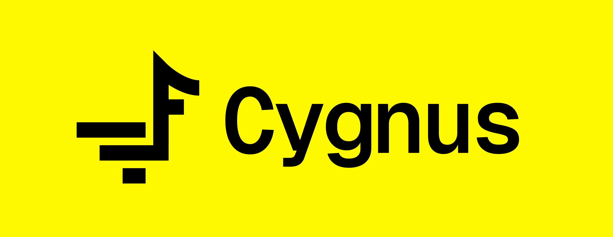

<br>

# Cygnus

> A lightweight HTML preprocessor for native `.html` component files.

## What is Cygnus?

Cygnus lets you split your UI into native `.html` component files with zero runtime overhead, no framework, and no virtual DOM. Write `@using` at the top of your HTML. Cygnus handles the rest.

## Key Features

- Native HTML components (no new file extension)
- Zero runtime overhead
- Seamless Vite integration
- Built-in error overlay
- Simple component system with variables

## Installation

```bash
npm install -D cygnus
```

## Usage

```html
@using "#nav" from "./components/nav.html"
@using "#footer" from "./components/footer.html"

<html lang="en">
<head>
    <meta charset="UTF-8">
    <title>My App</title>
</head>
<body>
    <div id="nav"></div>
    <div id="footer"></div>
</body>
</html>
```

## Syntax Reference

### `@using` — inject component
```html
@using "#sel" from "./file.html"
```

### `@name()` — auto-generate `<head>`
```html
@name('My App', './favicon.ico')
```
Generates `<meta charset>`, viewport, `<title>`, and optionally `<link rel="icon">`. Skipped if `<head>` already exists.

### `@using CSS` — inject stylesheet
```html
@using CSS "dialog.css"
```
Injects `<link rel="stylesheet">` into `<head>`.

### `*name.create()` — reusable variable
```html
*badge.create(<span class="badge">New</span>)

@using "#item1" from *badge
@using "#item2" from *badge
```

### Cross-file variable
```html
<!-- card.html -->
*card.create(<div class="card"><h3>Hello</h3></div>)
```
```html
<!-- index.html -->
@using "#x" from *card in "card.html"
```

### `toggle()` — runtime class toggle
```html
<button onclick="toggle('dialog')">Open</button>
```
```js
toggle('id')           // toggles class 'active' on #id
toggle('id', 'open')   // toggles custom class
```

## Running

### Standalone
```bash
cygnus ./src 3000
```

### With Vite
See `vite.config.js` setup in the repository.

```bash
npm run dev
```

## License
MIT — [LICENSE.md](./LICENSE.md)